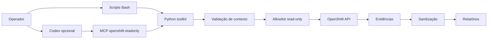

# OpenShift AIOps Toolkit

Plataforma profissional, local e somente leitura para diagnóstico, coleta de evidências, análise operacional e assistência por IA em Red Hat OpenShift Container Platform.

## Objetivo e público-alvo

Atender equipes de Operações, Infraestrutura, DevOps, SRE, Plataforma, Segurança e sustentação OpenShift em clusters de desenvolvimento, homologação, produção, cloud, on-premises, compactos, SNO, gerenciados e CRC/laboratório.

## Benefícios

- Diagnóstico padronizado e reproduzível.
- Multi-cluster com contexto explícito.
- Evidências sanitizadas e empacotáveis.
- Relatórios técnicos e executivos em Markdown.
- MCP `openshift-readonly` para Codex, sem terminal genérico.

## Arquitetura



## Pré-requisitos

Bash, Python 3.10+, `oc`, `jq`, `tar`, `gzip` e `sha256sum`. Opcionais: Codex CLI, `yq`, Podman e CRC.

## Instalação

```bash
git clone https://github.com/<org-ou-usuario>/openshift-aiops-toolkit.git
cd openshift-aiops-toolkit
scripts/install.sh
```

## Configuração e inventário

```bash
cp .env.example .env
cp inventories/clusters.example.yaml inventories/clusters.yaml
```

Nunca armazene tokens no inventário. Use kubeconfig já autenticado com permissão somente leitura.

Quando o toolkit roda dentro de um ambiente isolado, como VS Code/Flatpak, mas o `oc` está no host, configure:

```bash
export OPENSHIFT_AIOPS_COMMAND_PREFIX="flatpak-spawn --host"
export OPENSHIFT_AIOPS_OC_BIN="$HOME/.crc/cache/crc_libvirt_4.22.1_amd64/oc"
```

O prefixo aceito é restrito por allowlist; não há shell arbitrário.

## Uso em cluster único

```bash
scripts/preflight.sh --offline
scripts/preflight.sh --environment development
scripts/validar-contexto.sh
scripts/coletar-cluster.sh --cluster cluster-dev --environment development
scripts/gerar-relatorio.sh --path evidencias/cluster-dev/<coleta>
```

`scripts/preflight.sh --offline` e `make check` não acessam a API OpenShift. Use `make check-cluster` apenas depois de confirmar que o contexto atual é o cluster esperado.

## Uso em múltiplos clusters

```bash
scripts/listar-clusters.sh
scripts/coletar-cluster.sh --cluster cluster-hml --context hml-context --environment homologation
```

O toolkit não troca contexto silenciosamente.

## Produção

Em produção, confirme explicitamente cluster, API, usuário, versão e infraestrutura. O toolkit é assistivo; remediações seguem gestão de mudança externa.

## Codex e MCP

```bash
scripts/configurar-codex-mcp.sh
codex mcp list
```

Configuração manual: `.codex/config.toml.example`.

O script de configuração do MCP mostra o comando e pede confirmação antes de alterar a configuração do Codex. Use `scripts/configurar-codex-mcp.sh --yes` somente em automação consciente.

As ferramentas MCP aceitam parâmetros comuns opcionais para auditoria e segurança:

- `environment`: `development`, `homologation`, `laboratory` ou `production`;
- `cluster`: nome lógico do cluster;
- `timeout`: limite da consulta em segundos;
- `confirm_production`: obrigatório quando `environment=production`.

## Scripts principais

- `preflight.sh`: valida dependências, contexto, API e permissões.
- `coletar-cluster.sh`: coleta evidências gerais.
- `diagnosticar-pod.sh`, `diagnosticar-operator.sh`, `diagnosticar-node.sh`: investigação direcionada.
- `gerar-relatorio.sh`: cria relatório Markdown.
- `sanitizar-evidencias.sh` e `empacotar-evidencias.sh`: preparo para compartilhamento.

## Evidências

```text
evidencias/<cluster>/<YYYYMMDD-HHMMSS>/
  metadata/ cluster/ operators/ nodes/ namespaces/ workloads/
  storage/ network/ monitoring/ events/ logs/
  manifest.json
  checksums.sha256
```

## Segurança e RBAC

Não coleta conteúdo de Secrets, não altera recursos, bloqueia verbos de escrita, sanitiza credenciais e não expõe terminal genérico no MCP. Exemplo documental: `docs/examples/rbac-readonly-example.yaml`.

## Must-gather

`coletar-must-gather.sh` executa uma coleta controlada para laboratório/produção autorizada. A coleta pode gerar pacote grande e sensível, usa `umask 077`, grava em `evidencias/<cluster>/<timestamp>/must-gather/`, preserva `raw/`, gera manifesto, SHA256, marcador `DO-NOT-COMMIT.txt` e não faz upload.

Fluxo recomendado:

```bash
make must-gather-preflight ENVIRONMENT=laboratory CLUSTER=crc-lab
make must-gather ENVIRONMENT=laboratory CLUSTER=crc-lab
make analyze-must-gather RESOURCE=evidencias/<cluster>/<timestamp>/must-gather
```

O diretório bruto é classificado como confidencial e não deve ser publicado.

## Limitações

Permissões insuficientes reduzem evidências. Métricas dependem da API de métricas. Causa raiz só deve ser declarada com evidência suficiente.

## Troubleshooting

```bash
scripts/preflight.sh --offline --verbose
python3 -m compileall mcp_server
tests/run.sh
```

Documentos de validação:

- `docs/auditoria-estatica.md`;
- `docs/validacao-ambiente-local.md`;
- `docs/validacao-mcp.md`;
- `docs/validacao-crc.md`;
- `docs/matriz-testes.md`;
- `docs/matriz-compatibilidade.md`.
- `docs/matriz-mcp-scripts-must-gather.md`;
- `docs/comparacao-mcp-redhat.md`.

## Roadmap

Mais correlações, perfis de coleta por domínio e exportadores de relatório.

## Referências oficiais

- Red Hat OpenShift Documentation: https://docs.redhat.com/en/documentation/openshift_container_platform
- OpenShift CLI: https://docs.redhat.com/en/documentation/openshift_container_platform/latest/html/cli_tools/openshift-cli-oc
- Model Context Protocol: https://modelcontextprotocol.io/
