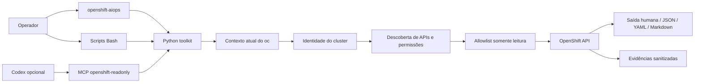

# OpenShift AIOps Toolkit

Toolkit local, consultivo e somente leitura para diagnosticar clusters Red Hat OpenShift, coletar evidências sanitizadas, gerar relatórios e expor ferramentas MCP específicas para uso com Codex.

O modelo operacional padrão é simples: o toolkit usa o contexto atual já autenticado no `oc`. Ele não exige ambiente, nome lógico do cluster, inventário, token no terminal nem confirmação de produção para consultas read-only.

## Objetivo

Atender equipes de Operações, Infraestrutura, DevOps, SRE, Plataforma, Segurança e sustentação OpenShift em CRC/OpenShift Local, clusters on-premises, clusters compactos, SNO, ambientes gerenciados e clusters cloud.

## Arquitetura



## Pré-requisitos

- Bash;
- Python 3.10+;
- `oc` autenticado no cluster desejado;
- `jq`, `tar`, `gzip` e `sha256sum`;
- opcionais: Codex CLI, `yq`, Podman e CRC/OpenShift Local.

## Instalação

```bash
git clone https://github.com/<org-ou-usuario>/openshift-aiops-toolkit.git
cd openshift-aiops-toolkit
scripts/install.sh
```

## Uso rápido

Valide primeiro qual cluster está ativo no seu terminal:

```bash
oc whoami
oc whoami --show-server
oc config current-context
```

Execute o diagnóstico resumido:

```bash
./openshift-aiops health
```

Comandos equivalentes via Makefile:

```bash
make health
make cluster
make operators
make nodes
make pods
make storage
make network
make ingress
make dns
make monitoring
make olm
make certificates
make capacity
make events
```

O toolkit nunca executa `oc login` nem `oc config use-context`; qualquer `--context` ou `--kubeconfig` informado vale apenas para o processo atual.

## Saídas

Modo humano é o padrão:

```bash
./openshift-aiops health
```

Formatos estruturados:

```bash
./openshift-aiops health --output json
./openshift-aiops health --output yaml
./openshift-aiops health --output markdown
NO_COLOR=1 ./openshift-aiops health
./openshift-aiops health --ascii
./openshift-aiops health --quiet
./openshift-aiops health --verbose
```

Problemas de saúde do cluster não são tratados automaticamente como falha técnica da ferramenta. Por exemplo, um Operator degradado aparece como achado, mas o comando pode retornar sucesso porque a consulta foi executada.

## Opções avançadas

Use somente quando precisar consultar outro contexto sem alterar o contexto persistente:

```bash
./openshift-aiops health --context outro-contexto
./openshift-aiops health --kubeconfig /caminho/kubeconfig
./openshift-aiops health --timeout 90
```

Parâmetros antigos continuam aceitos temporariamente por compatibilidade, mas estão obsoletos:

- `--environment`;
- `--cluster`;
- `--confirm-production`;
- variáveis `OPENSHIFT_AIOPS_ENVIRONMENT`, `OPENSHIFT_AIOPS_CLUSTER` e `OPENSHIFT_AIOPS_PRODUCTION_CONFIRM`.

Eles não são mais pré-requisito para diagnósticos comuns. O cluster é identificado pelo contexto atual, API e objeto `Infrastructure`.

## Ambiente isolado ou Flatpak

Quando o toolkit roda em um ambiente isolado e o `oc` está disponível no host, configure:

```bash
export OPENSHIFT_AIOPS_COMMAND_PREFIX="flatpak-spawn --host"
export OPENSHIFT_AIOPS_OC_BIN="/caminho/real/do/oc"
```

O prefixo aceito é restrito por allowlist; não há shell arbitrário.

## Inventários opcionais

Os arquivos em `inventories/` podem ser usados como aliases, metadados, comparação de clusters ou automações corporativas, mas não são exigidos para uso normal:

```bash
scripts/listar-clusters.sh
```

Não armazene tokens, senhas ou kubeconfigs completos em inventários.

## Evidências e relatórios

Coleta consultiva do cluster atual:

```bash
./openshift-aiops collect
# ou
scripts/coletar-cluster.sh
```

Gere relatório a partir da última coleta:

```bash
LATEST="$(ls -dt evidencias/*/* | head -1)"
scripts/gerar-relatorio.sh --path "$LATEST" --output relatorios/relatorio-diagnostico.md
```

Estrutura esperada:

```text
evidencias/<cluster>/<YYYYMMDD-HHMMSS>/
  metadata/ cluster/ operators/ nodes/ namespaces/ workloads/
  storage/ network/ monitoring/ events/ logs/
  manifest.json
  checksums.sha256
```

## Segurança

- Somente leitura por allowlist de comandos `oc`.
- Sem `oc apply`, `oc patch`, `oc delete`, `oc exec`, `oc debug`, `oc rsh`, `oc port-forward` ou equivalentes.
- Sem ferramenta MCP genérica de terminal.
- Sem leitura de conteúdo de Secrets.
- Sanitização de tokens, JWTs, Authorization headers, senhas e chaves.
- Timeout e truncamento de saída.
- Recursos opcionais ausentes são tratados como `NÃO APLICÁVEL`, `SEM PERMISSÃO` ou `INDISPONÍVEL`.

## Must-gather

`must-gather` é exceção operacional: ele pode criar recursos temporários e coletar dados sensíveis. Por isso exige confirmação digitando o identificador do cluster, independentemente de o cluster ser laboratório, produção ou qualquer outro ambiente.

Preflight:

```bash
make must-gather-preflight
```

Execução somente após autorização humana explícita:

```bash
make must-gather
```

O resultado é confidencial, gravado em `evidencias/<cluster>/<timestamp>/must-gather/`, com `umask 077`, manifesto, checksums, diretório bruto preservado e marcador `DO-NOT-COMMIT.txt`.

Validação em CRC/OpenShift Local: [docs/validacao-must-gather-crc-20260712.md](docs/validacao-must-gather-crc-20260712.md).

## Codex e MCP

```bash
scripts/configurar-codex-mcp.sh
codex mcp list
```

O servidor `openshift-readonly` publica ferramentas específicas, sem terminal genérico. Parâmetros comuns opcionais:

- `context`;
- `kubeconfig`;
- `timeout`;
- `output`;
- `verbose`.

`environment`, `cluster` e `confirm_production` continuam no schema apenas para compatibilidade e estão marcados como obsoletos.

## Validação local

Testes offline, sem acessar cluster:

```bash
scripts/preflight.sh --offline
make check
tests/run.sh
```

Validação consultiva em cluster atual somente depois de confirmar o contexto:

```bash
make check-cluster
./openshift-aiops health
```

## Documentação

- [Guia de migração para contexto automático](docs/migracao-contexto-automatico.md);
- [Guia passo a passo](docs/GUIA-PASSO-A-PASSO.md);
- [Processo operacional](docs/PROCESSO-OPERACIONAL.md);
- [MCP](docs/07-mcp.md);
- [Must-gather](docs/14-must-gather.md);
- [Matriz de testes](docs/matriz-testes.md);
- [Validação CRC](docs/validacao-crc.md).
- [Validação must-gather CRC](docs/validacao-must-gather-crc-20260712.md).

## Limitações

Permissões insuficientes reduzem evidências. Métricas dependem da Metrics API. Recursos opcionais variam entre CRC, SNO, OCP multinode e clusters gerenciados. Causa raiz só deve ser declarada com evidência suficiente.

## Referências oficiais

- Red Hat OpenShift Documentation: https://docs.redhat.com/en/documentation/openshift_container_platform
- OpenShift CLI: https://docs.redhat.com/en/documentation/openshift_container_platform/latest/html/cli_tools/openshift-cli-oc
- Model Context Protocol: https://modelcontextprotocol.io/
