# Arquitetura

Arquitetura: operador, Codex opcional, MCP, validação, allowlist, OpenShift API, evidências, sanitização e relatórios.

## Fluxo recomendado

1. Confirmar o contexto atual do `oc`.
2. Validar API OpenShift e usuário autenticado.
3. Executar comandos somente leitura.
4. Salvar evidências sanitizadas.
5. Separar fato, hipótese e conclusão.
6. Gerar plano de remediação sem executá-lo.

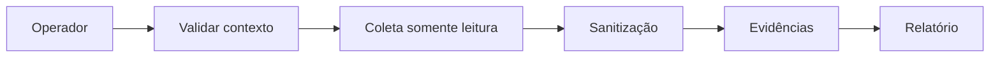

## Comandos úteis

```bash
./openshift-aiops health
./openshift-aiops collect
scripts/gerar-relatorio.sh --path evidencias/<cluster>/<coleta>
```

## Diagramas de referência

### 1. Arquitetura geral

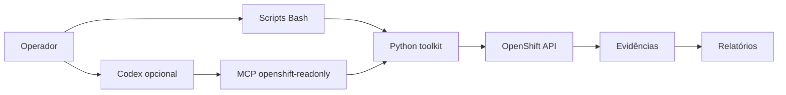

### 2. Codex, MCP e OpenShift

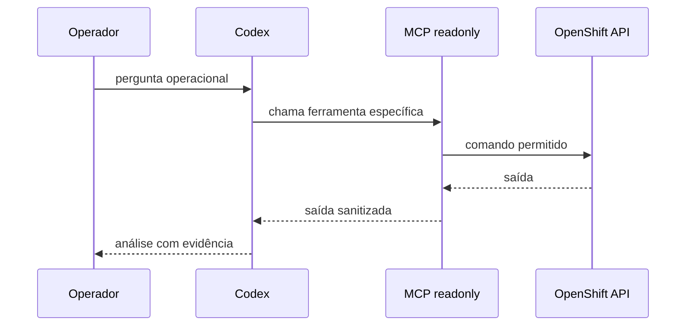

### 3. Identificação do cluster

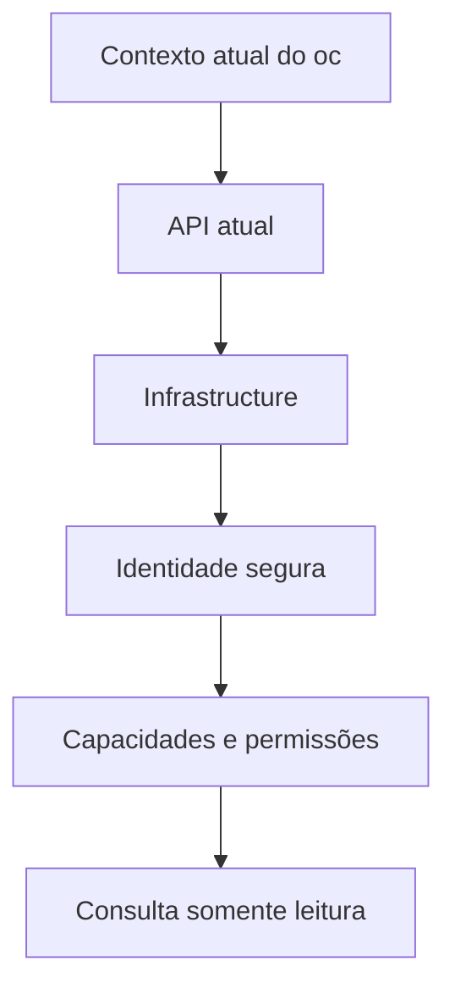

### 4. Fluxo de diagnóstico

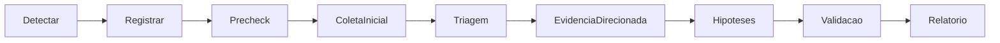

### 5. Fluxo de evidências

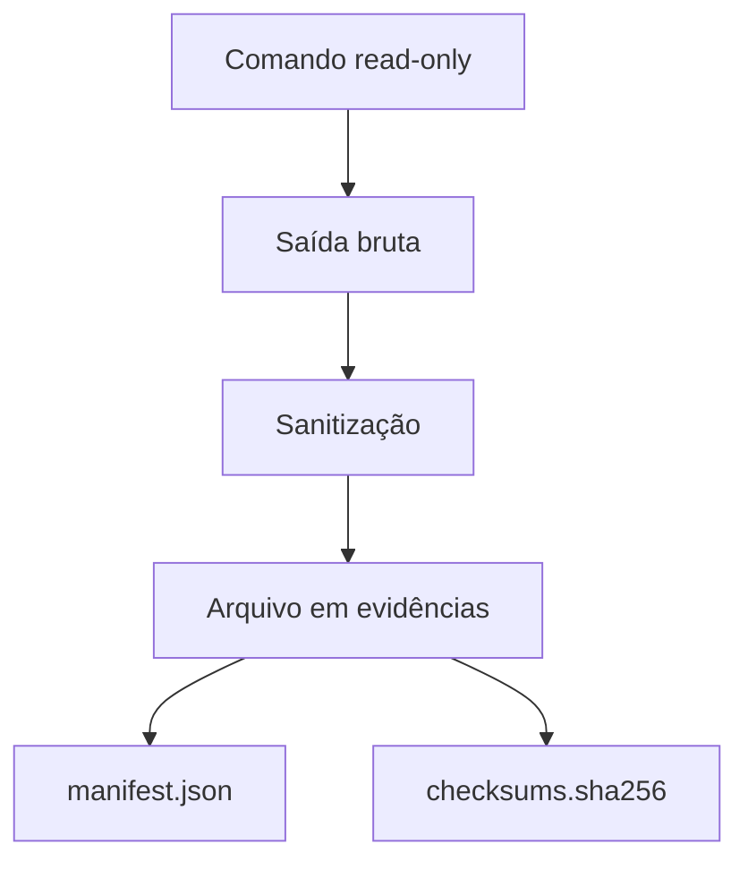

### 6. Fluxo de sanitização

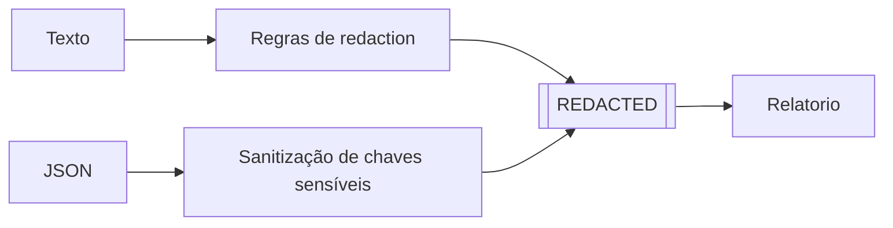

### 7. Fronteira de segurança

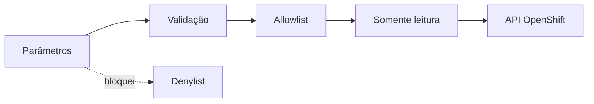

### 8. Processo de incidente

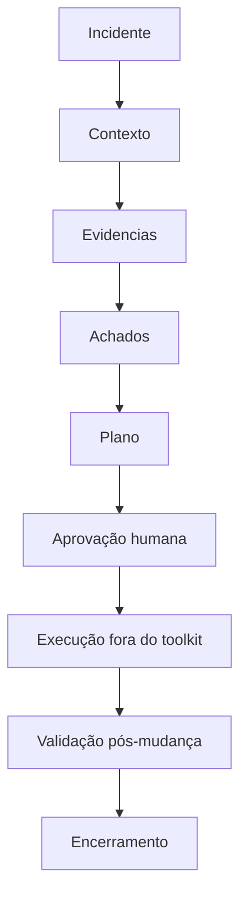

### 9. Comparação de coletas

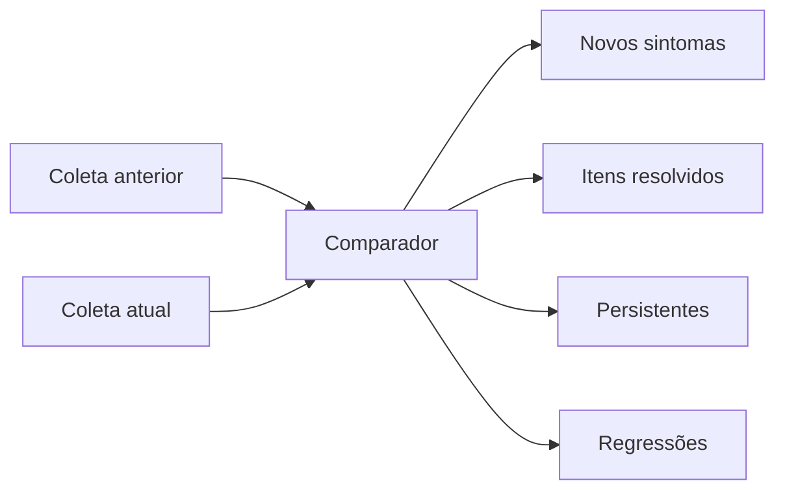

### 10. Operação em produção

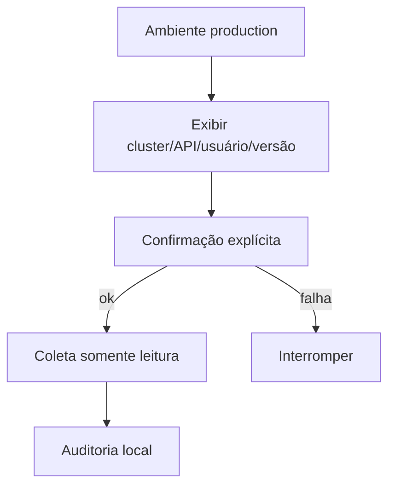
