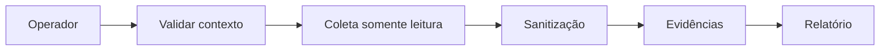

# Processo diagnóstico

Detecção → registro → contexto → pré-check → coleta → triagem → investigação → hipóteses → validação → plano → aprovação humana.

## Fluxo recomendado

1. Confirmar o contexto atual do `oc`.
2. Validar API OpenShift e usuário autenticado.
3. Executar comandos somente leitura.
4. Salvar evidências sanitizadas.
5. Separar fato, hipótese e conclusão.
6. Gerar plano de remediação sem executá-lo.



## Comandos úteis

```bash
./openshift-aiops health
./openshift-aiops collect
scripts/gerar-relatorio.sh --path evidencias/<cluster>/<coleta>
```
